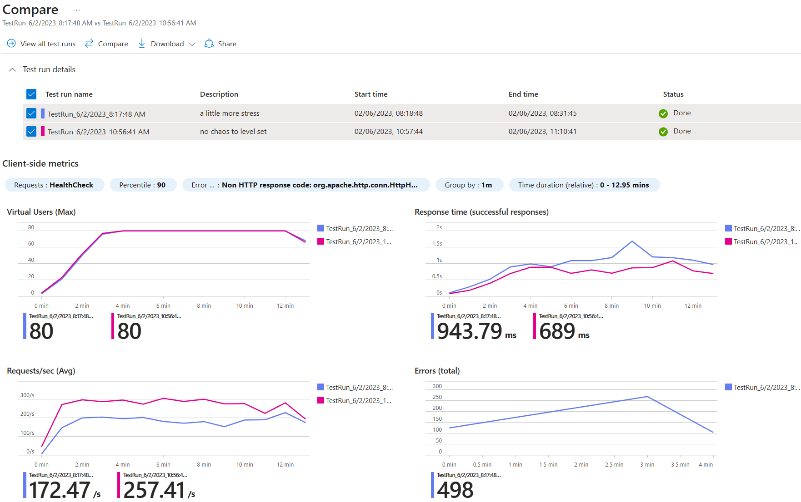
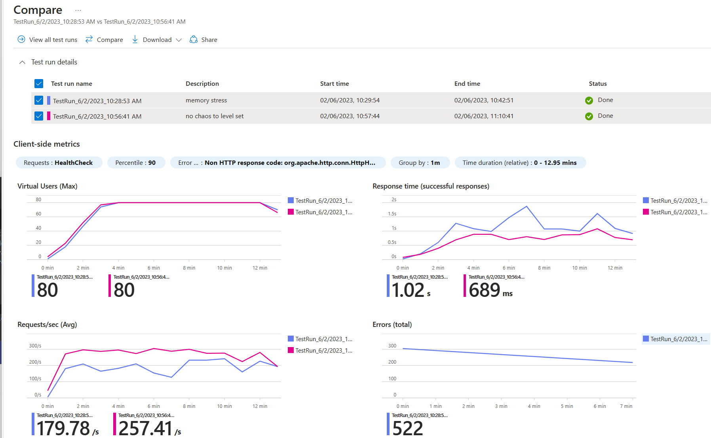

# Chaos AKS Stress
Chaos studio can use chaos mesh on AKS to apply CPU and memory stressors to an experiment. 

This repository shows how to make this work with a test workload on AKS.

This concentrates on stress at the pod or namespace level, not at the node pool level. There is a different set of Chaos Studio faults that target the AKS node pools specifically.


## Sample Application
This uses a healthcare sample API and can be provisioned from [here](https://github.com/microsoft/winwithappplatpoc/tree/main/Humongous.Healthcare)

## General Chaos Mesh
CPU and memory stress require the use of chaos mesh and so this has to be [installed](https://learn.microsoft.com/en-us/azure/chaos-studio/chaos-studio-tutorial-aks-portal#set-up-chaos-mesh-on-your-aks-cluster) on the cluster.

## CPU Stress

Target all pods in the *health-check* namespace.
```
{
    "action": "stress",
    "mode": "all",
    "duration": "600s",
    "stressors": {
        "cpu": {
            "workers": 2,
            "load": 90
        }
    },
    "selector": {
        "namespaces": [
            "health-check"
        ]
    }
}
```

Target a specific pod *humongous-healthcare-api* in the *health-check* namespace.
```
{
    "action": "stress",
    "mode": "all",
    "duration": "600s",
    "stressors": {
        "cpu": {
            "workers": 2,
            "load": 90
        }
    },
    "selector": {
        "namespaces": [
            "health-check"
        ],
        "labelSelectors": {
            "app": "humongous-healthcare-api"
        }
    }
}
```
### Load Test Comparison


## Memory Stress

Target a specific pod *humongous-healthcare-api* in the *health-check* namespace.
```{
    "action": "stress",
    "mode": "all",
    "duration": "600s",
    "selector": {
        "namespaces": [
            "health-check"
        ],
        "labelSelectors": {
            "app": "humongous-healthcare-api"
        }
    },
    "stressors": {
        "memory": {
            "workers": 4,
            "size": "256MB"
        }
    }
}
```

### Load Test Comparison

