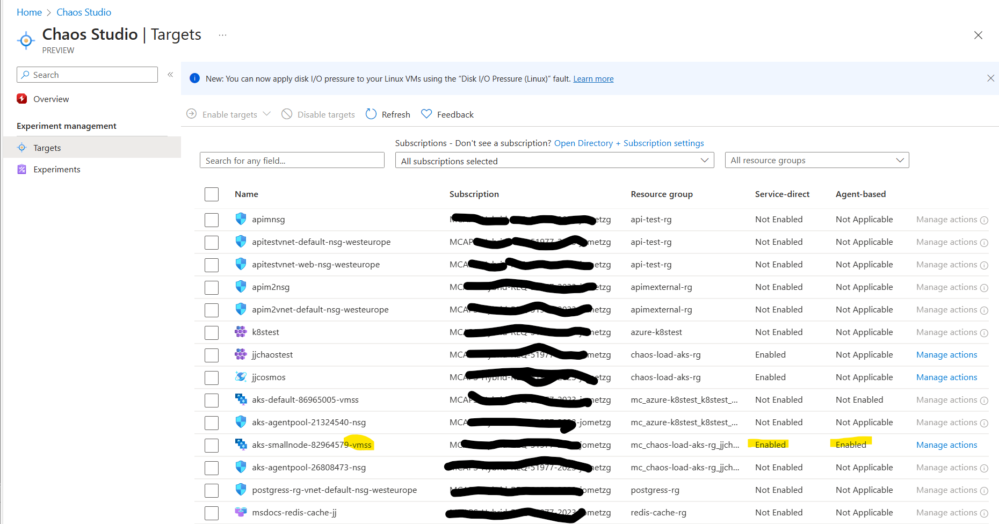
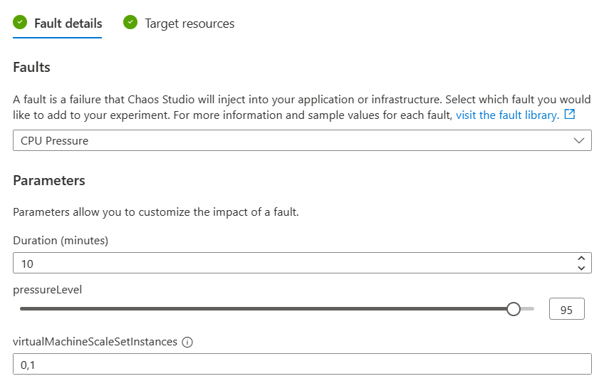
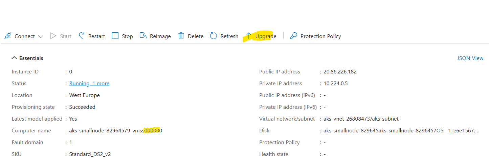
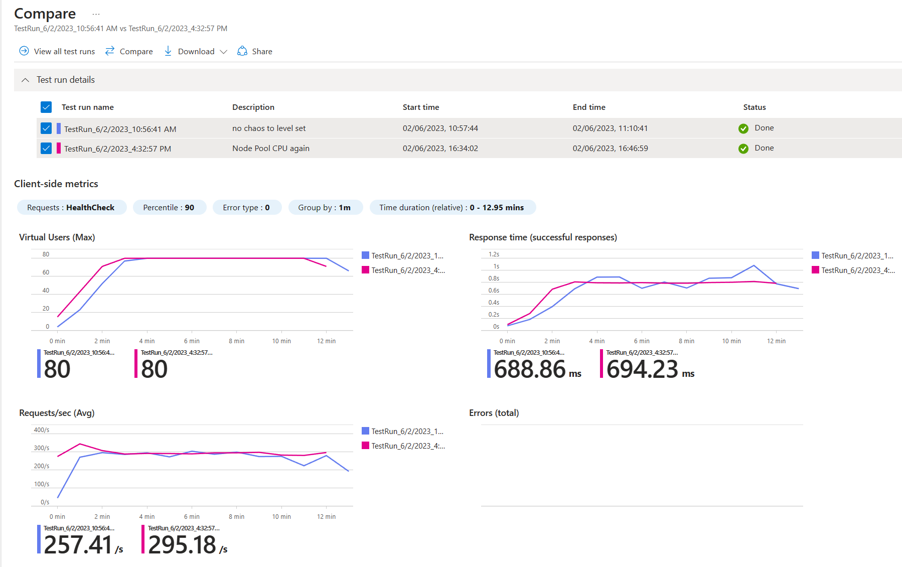
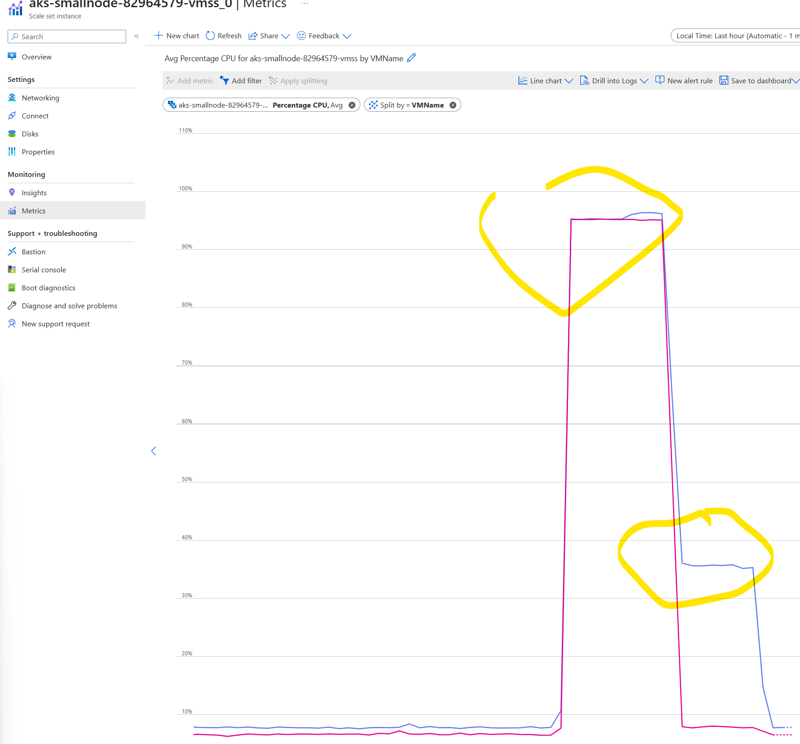

# Chaos AKS Stress
Chaos studio can use chaos mesh on AKS to apply CPU and memory stressors to an experiment. 

This repository shows how to make this work with a test workload on AKS.

The first half concentrates on stress at the pod or namespace level. The second half is on stress at the node pool level.


## Sample Application
This uses a healthcare sample API and can be provisioned from [here](https://github.com/microsoft/winwithappplatpoc/tree/main/Humongous.Healthcare)

## General Chaos Mesh
CPU and memory stress require the use of chaos mesh and so this has to be [installed](https://learn.microsoft.com/en-us/azure/chaos-studio/chaos-studio-tutorial-aks-portal#set-up-chaos-mesh-on-your-aks-cluster) on the cluster.

## CPU Stress

Target all pods in the *health-check* namespace.
```
{
    "action": "stress",
    "mode": "all",
    "duration": "600s",
    "stressors": {
        "cpu": {
            "workers": 2,
            "load": 90
        }
    },
    "selector": {
        "namespaces": [
            "health-check"
        ]
    }
}
```

Target a specific pod *humongous-healthcare-api* in the *health-check* namespace.
```
{
    "action": "stress",
    "mode": "all",
    "duration": "600s",
    "stressors": {
        "cpu": {
            "workers": 2,
            "load": 90
        }
    },
    "selector": {
        "namespaces": [
            "health-check"
        ],
        "labelSelectors": {
            "app": "humongous-healthcare-api"
        }
    }
}
```
### Load Test Comparison


## Memory Stress

Target a specific pod *humongous-healthcare-api* in the *health-check* namespace.
```{
    "action": "stress",
    "mode": "all",
    "duration": "600s",
    "selector": {
        "namespaces": [
            "health-check"
        ],
        "labelSelectors": {
            "app": "humongous-healthcare-api"
        }
    },
    "stressors": {
        "memory": {
            "workers": 4,
            "size": "256MB"
        }
    }
}
```

### Load Test Comparison


### Summary
Both of these stressors impact a running application on the AKS cluster. This mechanism allows for the targeting of specific pods or namespaces.


## Node Pool Chaos Stress
The previous stress tests targetted either an AKS pod or pods in a specific namespace - this is controlled by chaos mesh. You can also run CPU and memory stress on node pools.
For this to work, you need to enable chaos on the node pool VMSS.

### Configuration
This chaos fault does not require the chaos mesh to be installed in the AKS cluster, but it does require that the agent is installed on the virtual machines in the VMSS that represents the AKS node pool.

This enablement is done at the targets level and is shown below:


The chaos experiment fault definition is really simple:


### Making sure that the agent installs onto the Node Pool
If when the experiment runs, there is an error about not being able to find the *agent*, then you may have to force the virtual machine instances in the AKS VMSS to update.


This will need to be done to each of the instances in the node pool.

### CPU Stress results

What is striking from the above is that it has not really made that much difference to the results of the load test.

If we look at the metrics on the 2 node pool instances, we can definitely see the impact of the CPU stress on the VMs.

In the above graph:
1. the left highlighted area is the chaos experiment
2. the right highlighted area is the load test.

The only conclusion that can be drawn from this is that for this load test, the CPU on the node pool is not the most factor. In this case it uses a Cosmos database and this is the limiting factor. So whilst the node pool CPU stress does work, it's influence on the load test depends on what else is running on the cluster and more importantly a dependent service - Cosmos database.

## Conclusion
Both pod-level - via chaos mesh and node pool level are useful means of applying pressure onto a workload in an AKS cluster.

These do appear to yield slightly different outcomes in terms of this specific application and its load test.

Node pool stress faults are easier to implement than pod level ones as the requirements are simpler - no need to have chaos mesh, nor access to the Kubernetes API. Pod level stress faults offer more specific targeting and will also not potentially disrupt the whole AKS cluster, but are more complex to get working.

Ultimately, which is chosen depends on access to the cluster and how targeted the experiment needs to be.
